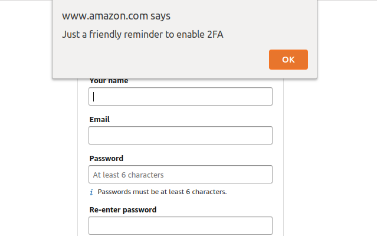

# 2fa-reminder
Get reminded to enable 2-Factor Authentication when signing up for websites/services.

## About
This is a simple Google Chrome extension that displays a reminder when you visit a "Sign Up" or "Registration" page.

## Installation
Before this gets submitted to the chrome store:
1. `git clone https://github.com/jamesthesken/2fa-reminder`
2. Open Google Chrome and navigate to `chrome://extensions`
3. Enable developer mode.
4. Navigate to "Load unpacked.." and select this directory.

### The Importance of 2-Factor Authentication
The more layers of security you put over your online accounts makes it harder for hackers to steal your information. Although it isn't the final-solution to online security, it will provide you ease-of-mind.

